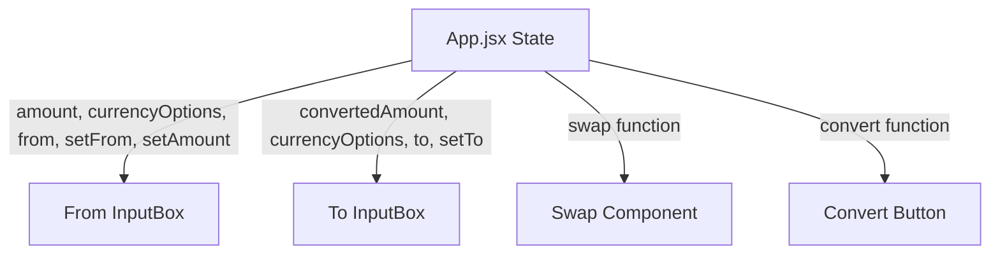

# Currency Converter UI & State Layout Reference

This document provides a breakdown of the React components and Tailwind CSS classes used in this project. It highlights **what each element does** and **how data flows** through them.

---

## Architecture Overview



---

## 1. Main Application Wrapper (`src/App.jsx`)
This component sets up the overall background, glassmorphic card container, and centralizes all the states (`amount`, `from`, `to`, `convertedAmount`).

```jsx
// Absolute full screen background with custom layout image and flex alignment
<div className="w-full h-screen flex flex-wrap justify-center items-center bg-financial">
  
  {/* Glassmorphic card container: semi-transparent, borders, shadow and backdrop blur */}
  <div className="w-full max-w-md mx-auto border border-white/20 rounded-lg p-5 backdrop-blur-xs bg-white/10 shadow-2xl">
    
    {/* Form container wrapping all layout elements to enable Enter-to-Submit */}
    <form onSubmit={(e) => { 
      e.preventDefault();
      convert(); 
    }}>
      {/* 1. From InputBox */}
      {/* 2. Swap Button */}
      {/* 3. To InputBox */}
      {/* 4. Convert Button */}
    </form>

  </div>
</div>
```

| Element / Class | Purpose |
| :--- | :--- |
| `bg-financial` | Displays the stock/finance chart background image (configured in `index.css`). |
| `backdrop-blur-xs` | Gives the card a modern glassmorphism aesthetic. |
| `bg-white/10` | Makes the card background slightly translucent white. |
| `onSubmit` | Prevents the default page reload and calls the `convert()` function. |

---

## 2. Reusable Input Box (`src/components/InputBox.jsx`)
A highly optimized, reusable element used for both entering the source amount ("From") and displaying the target amount ("To").

```jsx
<div className={`w-full bg-white p-3.5 rounded-lg flex text-sm shadow-sm ${className}`}>
  
  {/* Left Column: Label & Numeric Input */}
  <div className="w-1/2 flex flex-col justify-between">
    <label htmlFor={amountInputId} className="text-black/40 mb-2 inline-block font-medium">
      {label}
    </label>
    <input
      id={amountInputId}
      type="number"
      placeholder="0"
      disabled={amountDisable}
      className="outline-hidden w-full bg-transparent py-1.5 text-base font-semibold text-gray-800"
      value={amount}
      onChange={(e) => onAmountChange && onAmountChange(Number(e.target.value))}
    />
  </div>

  {/* Right Column: Currency Selection Dropdown */}
  <div className="w-1/2 flex flex-col items-end justify-between text-right">
    <p className="text-black/40 mb-2 font-medium">Currency Type</p>
    <select
      className="rounded-lg px-2 py-1 bg-gray-100 cursor-pointer outline-hidden hover:bg-gray-200 transition-colors font-semibold text-gray-700"
      value={selectCurrency}
      onChange={(e) => onCurrencyChange && onCurrencyChange(e.target.value)}
      disabled={currencyDisable}
    >
      {currencyOptions.map((currency) => (
        <option key={currency} value={currency}>
          {currency}
        </option>
      ))}
    </select>
  </div>
</div>
```

### Element Breakdown
1. **Container (`div`)**:
   * Uses `flex` to split components into two side-by-side columns (left: text field, right: select list).
2. **Left Column (Label & Input)**:
   * **`label`**: Dynamically renders `"From"` or `"To"`.
   * **`useId()` (`amountInputId`)**: Generates a unique HTML ID to bind the label to the input for accessibility/SEO.
   * **`input`**: A HTML `number` field. Triggers `onAmountChange` callback with the parsed number whenever the user types.
   * **`amountDisable`**: Disables input editing (passed as `true` in the `"To"` card so users can't edit calculated results).
3. **Right Column (Select Dropdown)**:
   * **`select`**: Controlled dropdown with its value set to `selectCurrency` (USD, INR, etc.). Triggers `onCurrencyChange` on choice.
   * **`currencyOptions.map`**: Iterates through the list of fetched currency codes to generate `<option>` elements dynamically.

---

## 3. Centered Swap Button (`src/components/Swap.jsx`)
An absolute-positioned button designed to overlay perfectly on top of the horizontal seam between the two input boxes.

```jsx
<div className="relative w-full h-0.5">
  <button
    type="button"
    className="absolute left-1/2 -translate-x-1/2 -translate-y-1/2 border-2 border-white rounded-md bg-blue-600 text-white px-2 py-0.5 text-sm font-semibold shadow-md active:scale-95 transition-all hover:bg-blue-700 cursor-pointer"
    onClick={onSwap}
  >
    swap
  </button>
</div>
```

| Element / Class | Purpose |
| :--- | :--- |
| `relative w-full h-0.5` | Establishes a thin container acting as a boundary line. |
| `absolute left-1/2 -translate-x-1/2` | Centers the button horizontally inside the form. |
| `-translate-y-1/2` | Pulls the button upward by half its height so it sits exactly on the border line. |
| `active:scale-95` | A responsive micro-animation click feedback effect. |
| `onClick={onSwap}` | Executes the parent swap function to exchange "From" / "To" values. |

---

## 4. Convert Button (`src/App.jsx`)
Triggers the conversion calculation.

```jsx
<button
  type="submit"
  className="w-full bg-blue-600 text-white px-4 py-3 rounded-lg font-semibold hover:bg-blue-700 active:scale-[0.99] transition-all duration-200 shadow-md cursor-pointer mt-4"
>
  Convert {from.toUpperCase()} to {to.toUpperCase()}
</button>
```

* **`type="submit"`**: Automatically triggers the parent form's `onSubmit` event, executing the conversion function.
* **`from.toUpperCase() to to.toUpperCase()`**: Converts values (like `"usd"` and `"inr"`) to clean uppercase string displays (e.g., `USD` to `INR`).
