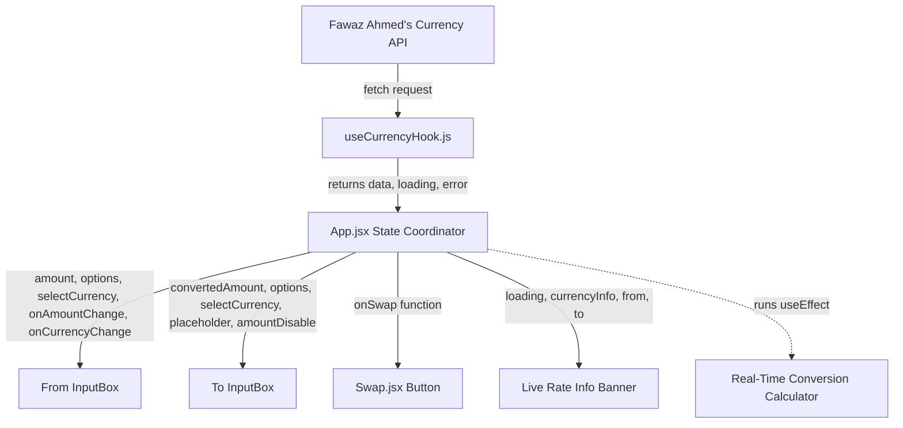

# Currency Converter UI, Hooks & State Reference

This document provides a comprehensive technical guide to the Currency Converter codebase. It details how data flows, how state hooks interact, and the layout structure of each component.

---

## 🏗️ Architecture & State Flow



---

## 1. State Coordinator (`src/App.jsx`)
The central hub of the application. It coordinates user inputs, currency selection, live rate fetching, and automatic conversion triggers.

### Component Logic

```javascript
function App() {
  const [amount, setAmount] = useState("");
  const [from, setFrom] = useState("usd");
  const [to, setTo] = useState("inr");
  const [convertedAmount, setconvertedAmount] = useState(0);

  // Custom hook handles asynchronous data fetching, loading, and error states
  const { data: currencyInfo, loading, error } = useCurrencyHook(from);
  
  // Extract all currency option keys dynamically from the exchange rates object
  const options = Object.keys(currencyInfo || {});

  // Swaps From/To selections and their current numeric values
  const swap = () => {
    setFrom(to);
    setTo(from);
    setconvertedAmount(amount);
    setAmount(convertedAmount);
  }

  // Backup conversion method triggered on form submit
  const convert = () => {
    if (currencyInfo && currencyInfo[to]) {
      setconvertedAmount(Number(amount) * currencyInfo[to]);
    }
  }

  // Effect: Recalculates the converted value in real-time as values change
  useEffect(() => {
    if (currencyInfo && currencyInfo[to]) {
      setconvertedAmount(Number(amount) * currencyInfo[to]);
    }
  }, [amount, from, to, currencyInfo]);
  
  // ... JSX returns ...
}
```

### UI Implementation Details
* **Error Banner**: Renders conditionally when `error` is not null (e.g. if the user is offline or the rate API fails).
  ```jsx
  {error && (
    <div className="w-full bg-red-500/10 border border-red-500/20 text-red-200 text-xs text-center py-2 px-3 rounded-lg mb-4 font-semibold">
      ⚠️ Network Error: Using offline/stale rates.
    </div>
  )}
  ```
* **"To" Card Placeholder**: While the hook is fetching new rates, the "To" input box clears its value and displays a `"Loading..."` placeholder to indicate background network activity.
  ```jsx
  <InputBox
    label="To"
    amount={loading ? "" : convertedAmount}
    placeholder={loading ? "Loading..." : "0"}
    currencyOptions={options}
    onCurrencyChange={(currency) => setTo(currency)}
    selectCurrency={to}
    amountDisable
  />
  ```
* **Live Exchange Rate Info Banner**: Replaced the redundant "Convert" button at the bottom. Since the app updates values in real-time as you type, this banner dynamically displays the current 1-to-1 exchange rate ratio formatted to 4 decimal places, rendering a spinning loader during updates.
  ```jsx
  <div className="w-full bg-blue-600/10 border border-blue-500/20 text-blue-200 text-center py-3 px-4 rounded-lg font-semibold shadow-inner backdrop-blur-md mt-4 select-none">
    {loading ? (
      <span className="flex items-center justify-center gap-2">
        <svg className="animate-spin h-4 w-4 text-blue-400" xmlns="http://www.w3.org/2000/svg" fill="none" viewBox="0 0 24 24">
          <circle className="opacity-25" cx="12" cy="12" r="10" stroke="currentColor" strokeWidth="4"></circle>
          <path className="opacity-75" fill="currentColor" d="M4 12a8 8 0 018-8V0C5.373 0 0 5.373 0 12h4zm2 5.291A7.962 7.962 0 014 12H0c0 3.042 1.135 5.824 3 7.938l3-2.647z"></path>
        </svg>
        Fetching exchange rate...
      </span>
    ) : currencyInfo && currencyInfo[to] ? (
      `1 ${from.toUpperCase()} = ${currencyInfo[to].toFixed(4)} ${to.toUpperCase()}`
    ) : (
      "Exchange rate unavailable"
    )}
  </div>
  ```

---

## 2. Custom Currency Hook (`src/hook/currencyHook.js`)
An asynchronous custom React hook that manages fetch states, loading transitions, and network errors.

### Implementation

```javascript
import { useEffect, useState } from "react";

function useCurrencyHook(currency) {
    const [data, setData] = useState({});
    const [loading, setLoading] = useState(false);
    const [error, setError] = useState(null);

    useEffect(() => {
        if (!currency) return;
        setLoading(true);
        setError(null);

        fetch(`https://cdn.jsdelivr.net/npm/@fawazahmed0/currency-api@latest/v1/currencies/${currency}.json`)
            .then((res) => {
                if (!res.ok) {
                    throw new Error(`Failed to fetch exchange rates: ${res.statusText}`);
                }
                return res.json();
            })
            .then((res) => {
                if (res && res[currency]) {
                    setData(res[currency]);
                }
                setLoading(false);
            })
            .catch((err) => {
                console.error("Error in useCurrencyHook:", err);
                setError(err.message || "Failed to fetch exchange rates");
                setData({}); // Clear stale data on failure
                setLoading(false);
            });
    }, [currency]);

    // Returns state package back to the App component
    return { data, loading, error };
}

export default useCurrencyHook;
```

---

## 3. Reusable Input Box (`src/components/InputBox.jsx`)
Splits the card into a left input field and a right dropdown list, handling accessibility, selection states, and focus events.

```jsx
function InputBox({
  label,
  amount,
  onAmountChange,
  onCurrencyChange,
  currencyOptions = [],
  selectCurrency = "usd",
  amountDisable = false,
  currencyDisable = false,
  className = "",
  placeholder = "0",
}) {
  // useId generates a unique HTML ID for screen-reader and SEO accessibility
  const amountInputId = useId();

  return (
    <div className={`w-full bg-white p-3.5 rounded-lg flex text-sm shadow-sm ${className}`}>
      
      {/* Left Section: Label and Input Field */}
      <div className="w-1/2 flex flex-col justify-between">
        <label htmlFor={amountInputId} className="text-black/40 mb-2 inline-block font-medium">
          {label}
        </label>
        <input
          id={amountInputId}
          type="number"
          placeholder={placeholder}
          disabled={amountDisable}
          className="outline-hidden w-full bg-transparent py-1.5 text-base font-semibold text-gray-800"
          value={amount}
          onChange={(e) => onAmountChange && onAmountChange(e.target.value === "" ? "" : Number(e.target.value))}
          onFocus={(e) => e.target.select()}
        />
      </div>

      {/* Right Section: Currency Dropdown Selection */}
      <div className="w-1/2 flex flex-col items-end justify-between text-right">
        <p className="text-black/40 mb-2 font-medium">Currency Type</p>
        <select
          className="rounded-lg px-2 py-1 bg-gray-100 cursor-pointer outline-hidden hover:bg-gray-200 transition-colors font-semibold text-gray-700"
          value={selectCurrency}
          onChange={(e) => onCurrencyChange && onCurrencyChange(e.target.value)}
          disabled={currencyDisable}
        >
          {currencyOptions.map((currency) => (
            <option key={currency} value={currency}>
              {currency}
            </option>
          ))}
        </select>
      </div>

    </div>
  )
}
```

### Key Technical Details:
* **Empty Input Handling**: The `onChange` handler checks if the string is empty `e.target.value === "" ? ""` and returns an empty string, otherwise parsing it as a float. This prevents the number box from breaking or displaying annoying zero artifacts when clearing the input field.
* **Auto-Select on Focus (`onFocus`)**: Runs `e.target.select()` on focus. When the user clicks or tabs into the amount field, it immediately selects the entire number, allowing them to overwrite it with their keyboard without having to manually backspace or select.

---

## 4. Centered Swap Button (`src/components/Swap.jsx`)
An absolute-positioned layout button positioned perfectly at the visual center over the dividing line between inputs.

```jsx
function Swap({ onSwap }) {
  return (
    <div className="relative w-full h-0.5">
      <button
        type="button"
        className="absolute left-1/2 -translate-x-1/2 -translate-y-1/2 border-2 border-white rounded-md bg-blue-600 text-white px-2 py-0.5 text-sm font-semibold shadow-md active:scale-95 transition-all hover:bg-blue-700 cursor-pointer"
        onClick={onSwap}
      >
        swap
      </button>
    </div>
  )
}
```

---

## 5. App Header (`src/components/Headers.jsx`)
Renders the app logo, heading, and subtitle cleanly with a glassmorphic background container.

```jsx
function Headers() {
  return (
    <div className="flex flex-col items-center mb-6 text-center">
      <div className="w-20 h-20 bg-blue-600/10 border border-blue-500/20 rounded-full flex items-center justify-center p-2.5 shadow-inner backdrop-blur-md mb-3">
        <svg className="w-full h-full animate-[spin_25s_linear_infinite]" viewBox="0 0 512 512" xmlns="http://www.w3.org/2000/svg">
          {/* SVG paths represent a bold, high-contrast double arrow exchange */}
          <path d="M 120 190 H 380 M 310 120 L 380 190 L 310 260" fill="none" stroke="url(#header-logo-grad)" strokeWidth="56" strokeLinecap="round" strokeLinejoin="round" />
          <path d="M 392 322 H 132 M 202 252 L 132 322 L 202 392" fill="none" stroke="url(#header-logo-grad)" strokeWidth="56" strokeLinecap="round" strokeLinejoin="round" />
        </svg>
      </div>
      <h1 className="text-2xl font-bold text-white tracking-wide">Currency Converter</h1>
      <p className="text-white/60 text-xs mt-1 font-medium">Live Daily Exchange Rates</p>
    </div>
  )
}
```
